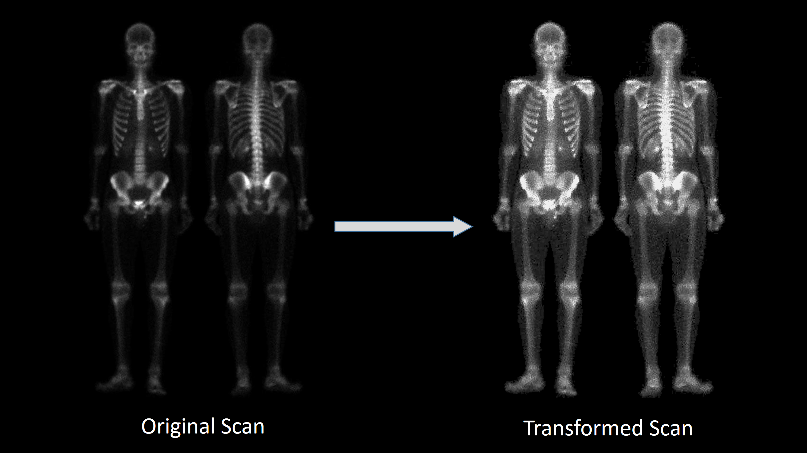
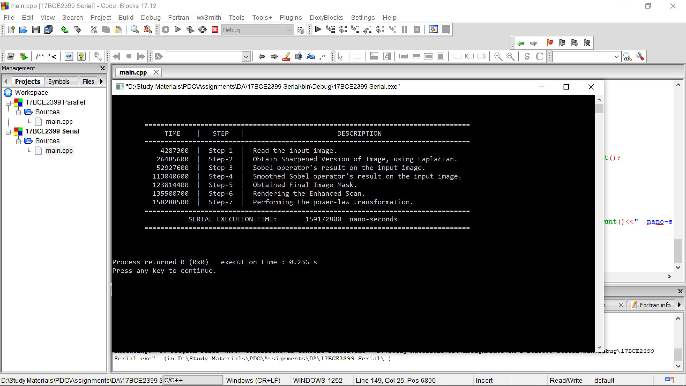
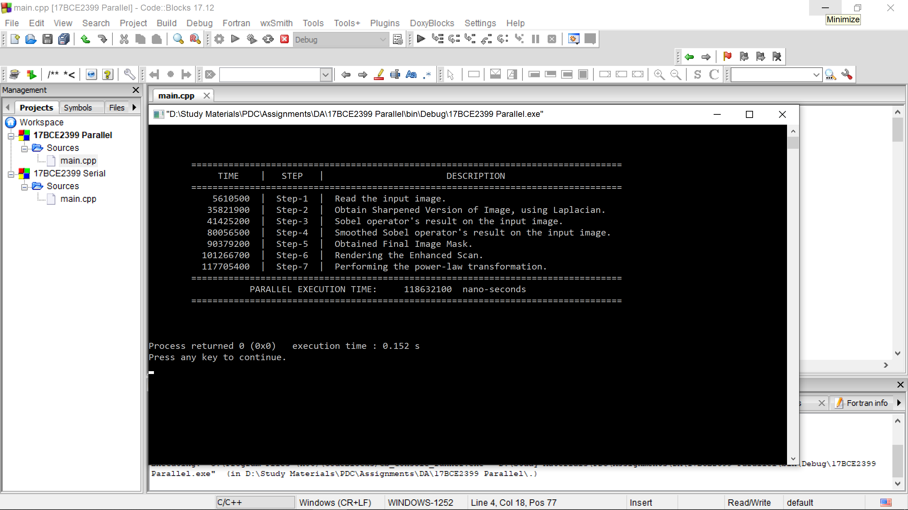
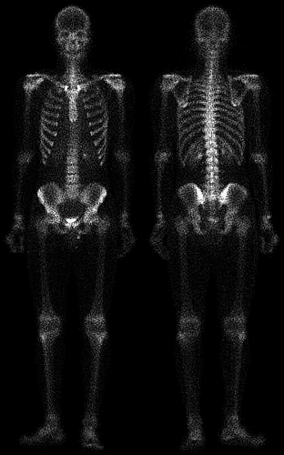
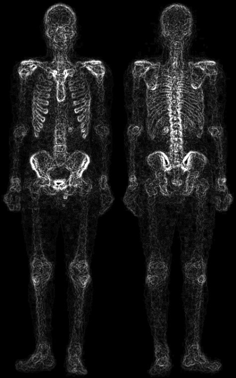
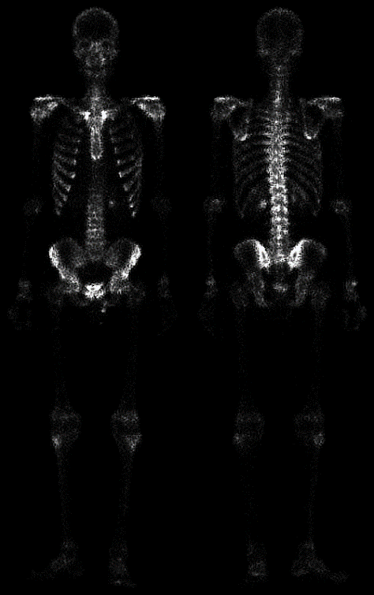
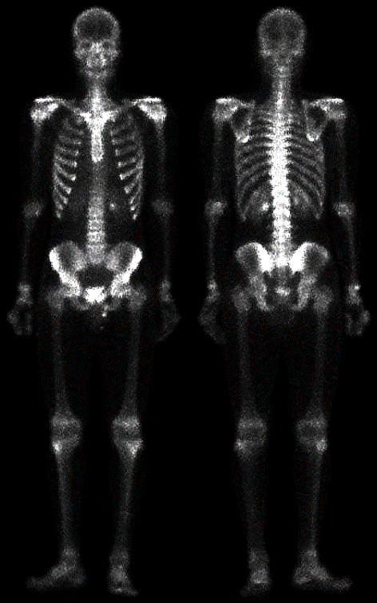
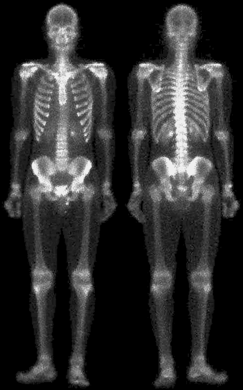

# Bonescan-Enhancer

An application for enhancing the raw bone-scans via the usage of *Parallel Computing* and *Image Processing principles*, in order to facilitate convenient and efficient diagnosis.

---

## Performance Comparison

The following are the screenshots for the serial and parallel implementations of the application in consideration, which clearly show that the parallel implementation out-performs the serail code, with a *speed-up factor* of about **1.4**.

---

## Step-by-Step Output analysis

1. Original Scan

    

1. Action of the Laplacian operator 

    

1. Action of the Sobel operator 

    

1. Application of a 5&times;5 Smoothening filter on *step-3*'s Output

    

1. Image mask obtained by multiplying outputs of *step-2* and *step-4*

    

1. Rendering of enhanced scan 

    

1. Action of the Power-Law transform 

    
